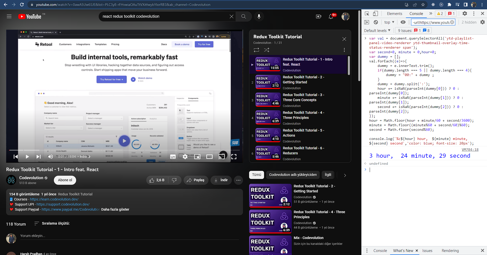

# Basic Youtube Playlist Total Time Calculator 


This app is a simple Youtube Playlist total time calculator script. It is simple to use. Does not need a program to run.It is enough to open youtube  any browser for the run software.

## How Does It Work?
First, open the youtube and select playlist. Open browser console. Paste the [code](https://github.com/bugraakgun/youtube-playlist-total-time-calculator/blob/main/console-command.js) and press enter.It's pie!

### Browser Console Shortcut
`Chrome: Ctrl + Shift + J, F12`

`Firefox: Ctrl + Shift + I, F12`

`Edge: Ctrl + Shift + I, F12`

`Safari: Ctrl + Shift + J`

### **Code**
````javascript
var val = document.querySelectorAll('ytd-playlist-panel-video-renderer ytd-thumbnail-overlay-time-status-renderer span');
var second=0, minute = 0,hour=0;
var dummy = [];
val.forEach((e)=>{
	dummy = e.innerText.trim();
	if(dummy.length === 5 || dummy.length === 4){
		dummy = "00:" + dummy ;
	}
	dummy = dummy.split(':');
	hour += isNaN(parseInt(dummy[0])) ? 0 : parseInt(dummy[0]);
	minute += isNaN(parseInt(dummy[1])) ? 0 : parseInt(dummy[1]);
	second += isNaN(parseInt(dummy[2])) ? 0 : parseInt(dummy[2]);
});
hour = Math.floor(hour + minute/60 + second/3600);
minute = Math.floor((minute%60 + second/60)%60);
second = Math.floor(second%60);

console.log(`%c${hour} hour,  ${minute} minute, ${second} second`,'color: blue; font-size: 20px');
````
